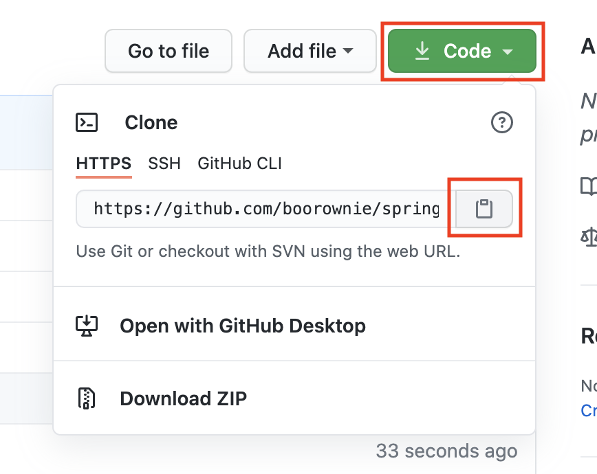
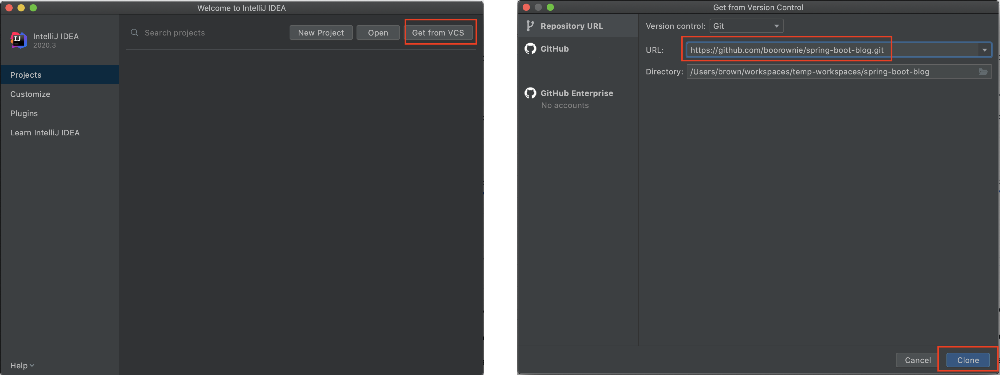
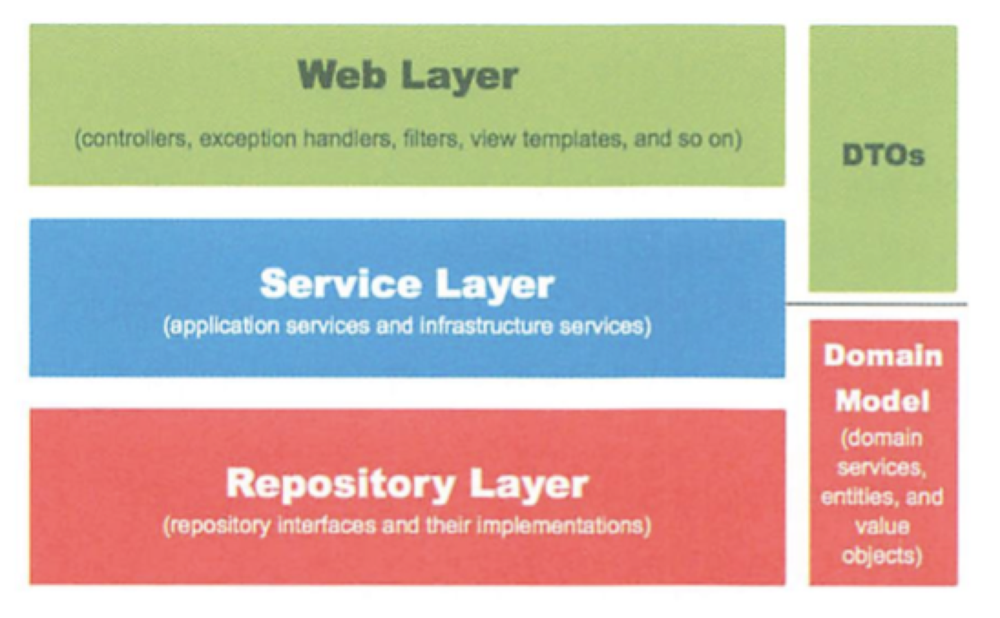

# 핸즈온 소개
- 스프링 부트로 게시판 만드는 시작 과정을 따라하기
- 뼈대 코드를 기반으로 진행
- 페이지 연동, 글쓰기 API 구현 등 예시 코드를 통해 개발 흐름을 경험

> 본 핸즈온은 이동욱님의 "스프링 부트와 AWS로 혼자 구현하는 웹 서비스"를 참고하여 구성하였습니다.

# 따라 하기

## 클론 받기

### Clone 주소 복사


### 인텔리제이 프로젝트 생성



## 글 등록 페이지 연동
### 요청 응답 테스트 (web/PageControllerTest.java)
```java
@DisplayName("글 작성 페이지")
@Test
void save() {
    RestAssured.given().log().all()
            .when().get("/posts/save")
            .then().log().all()
            .statusCode(HttpStatus.OK.value());
}
```
- 글 등록 페이지 요청(`/posts/save`)을 검증하는 테스트
- 페이지 요청을 처리하는 기능을 구현하기 전에 테스트를 수행하면서 기능 구현 전 구현할 내용에 대해 숙지
- 현재 기능 구현 전이므로 테스트는 실패함

### 요청 처리 (web/PageController.java)
```java
@GetMapping("/posts/save")
public String save() {
    return "posts-save";
}
```
- `/posts/save` 요청을 처리하는 메서드
- "posts-save"을 리턴하여 templates/posts-save.xxx 파일가 응답되도록 설정  
- 본 프로젝트는 mustache에 대한 의존성이 추가되어 있어서 posts-save.mustache 파일에 연동됨 
  
### 테스트 확인 및 프로그램 동작 확인
- `save` 테스트 성공을 확인하고 실제 동작하는지 확인


## 글 등록 API 구현

### API 구현에 필요한 코드 확인
- Request 데이터를 받을 DTO
- API 요청을 받을 Controller
- 비지니스 로직이 있는 Domain 과 Repository
- 트랜잭션, 도메인 기능 간의 순서를 보장하는 Service

#### 웹 계층


### API 테스트 (web/PostApiControllerTest.java) 
```java
@DisplayName("게시글을 등록한다")
@Test
void save() {
    String requestParams =
    "{\n" +
    "    \"title\": \"title\",\n" +
    "    \"content\": \"content\",\n" +
    "    \"author\": \"author\"\n" +
    "}";

    RestAssured.given().log().all()
        .contentType(MediaType.APPLICATION_JSON_VALUE)
        .accept(MediaType.APPLICATION_JSON_VALUE)
        .body(requestParams)
        .when().post("/api/posts")
        .then().log().all()
        .statusCode(HttpStatus.OK.value());
}
```

- 게시글 등록 API 요청(`/api/posts`)을 검증하는 테스트
- 요청 시 request param에 대한 요구사항을 명확히 할 수 있음

### DTO 구현 (web/dto/PostSaveRequestDto.java)

```java
public class PostSaveRequestDto {
    private String title;
    private String content;
    private String author;

    public PostSaveRequestDto() {
    }

    public String getTitle() {
        return title;
    }

    public String getContent() {
        return content;
    }

    public String getAuthor() {
        return author;
    }
}
```

- API 테스트에 맞춰서 DTO 클래스를 생성

### Controller 구현 (web/PostApiController.java)
```java
@RestController
public class PostApiController {
    @PostMapping("/api/posts")
    public ResponseEntity save(@RequestBody PostSaveRequestDto requestDto) {
        return ResponseEntity.ok().build();
    }
}
```

- `/api/posts` 요청을 처리하는 메서드
- PageController와는 다르게 @RestController 지정된 컨트롤러로 처리
- 요청 시 body로 넘긴 PostSaveRequestDto 정보는 @RequestBody 선언을 통해 메서드 파라미터로 활용 가능
- ResponseEntity 객체로 리턴하여 응답 코드를 지정할 수 있음

### 요청에 대한 처리를 Service로 위임
```java
@RestController
public class PostApiController {
    private PostService postService;

    public PostApiController(PostService postService) {
        this.postService = postService;
    }
    
    @PostMapping("/api/posts")
    public ResponseEntity save(@RequestBody PostSaveRequestDto requestDto) {
        postService.save(requestDto);
        return ResponseEntity.ok().build();
    }
}
```

- 요청에 대한 처리를 service로 위임
- PostService 클래스는 아직 구현되지 않았지만 뼈대만 먼저 만듬

```java
@Service
public class PostService {
    public void save(PostSaveRequestDto requestDto) {

    }
}
```

- PostService는 뼈대만 만들고 다음 단계를 대기

### Domain 구현 (domain/Post.java)
```java
@Entity
public class Post {
    @Id
    @GeneratedValue(strategy = GenerationType.IDENTITY)
    private Long id;

    @Column(length = 500, nullable = false)
    private String title;

    @Column(columnDefinition = "TEXT", nullable = false)
    private String content;

    private String author;

    public Post() {
    }

    public Post(String title, String content, String author) {
        this.title = title;
        this.content = content;
        this.author = author;
    }

    public Long getId() {
        return id;
    }

    public String getTitle() {
        return title;
    }

    public String getContent() {
        return content;
    }

    public String getAuthor() {
        return author;
    }
}
```

- 게시글의 도메인 클래스 생성
- DB에서 게시글 정보를 관리할 때 사용할 테이블 정보로 게시글 도메인 클래스를 활용, 활용하기 위해 클래스에 @Entity 선언
- 테이블의 컬럼 정보를 @Id, @Column 등의 애너테이션을 이용하여 부여

### Repository 구현 (domain/PostRepository.java)
```java
public interface PostRepository extends JpaRepository<Post, Long> {
}
```

- DB 접근 시 활용하기 위해 Repository 인터페이스 생성
- 구현은 따로 하지 않아도 됨
- 정상 동작 확인을 위해 PostRepositoryTest의 게시글저장_불러오기 테스트 메서드 활용 가능

### Service 구현 (service/PostService.java)
```java
@Service
public class PostService {
    private PostRepository postRepository;

    public PostService(PostRepository postRepository) {
        this.postRepository = postRepository;
    }

    public void save(PostSaveRequestDto requestDto) {
        postRepository.save(requestDto.toEntity());
    }
}
```  

- 요청에 따라 저장할 수 있도록 PostRepository에 대한 의존을 추가
- PostSaveRequestDto를 Post로 변환하기 위해 toEntity 메서드를 생성

```java
public Post toEntity() {
    return new Post(title, content, author);
}
```

### 테스트 확인 및 프로그램 동작 확인 (web/PostApiControllerTest)
- `save` 테스트 성공을 확인하고 실제 동작하는지 확인

## 글 목록 조회 추가

### Controller 수정 (web/PageController.java)
```java
@Controller
public class PageController {
    private PostService postService;

    public PageController(PostService postService) {
        this.postService = postService;
    }

    @GetMapping("/")
    public String index(Model model) {
        model.addAttribute("posts", postService.findAll());
        return "index";
    }
    ...
}
```

- posts 를 응답하기 위해 index 메서드의 구현을 수정
- postService.findAll()는 없는 메서드지만 뼈대만 우선 생성

### Service 수정 (servicePostService.java)
```java
public List<PostListResponseDto> findAll() {
    return postRepository.findAll().stream()
        .map(post -> new PostListResponseDto(post))
        .collect(Collectors.toList());
}
```

- postRepository를 통해 모든 Post를 조회하기 위해 findAll 메서드 활용
- List<Post>를 List<PostListResponseDto>로 변환하기 위한 로직 추가

### DTO (web/dto/PostListResponseDto.java)

```java
public class PostListResponseDto {
    private Long id;
    private String title;
    private String author;

    public PostListResponseDto(Post entity) {
        this.id = entity.getId();
        this.title = entity.getTitle();
        this.author = entity.getAuthor();
    }

    public Long getId() {
        return id;
    }

    public String getTitle() {
        return title;
    }

    public String getAuthor() {
        return author;
    }
}
```
